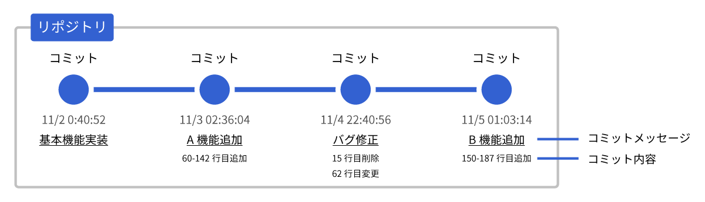
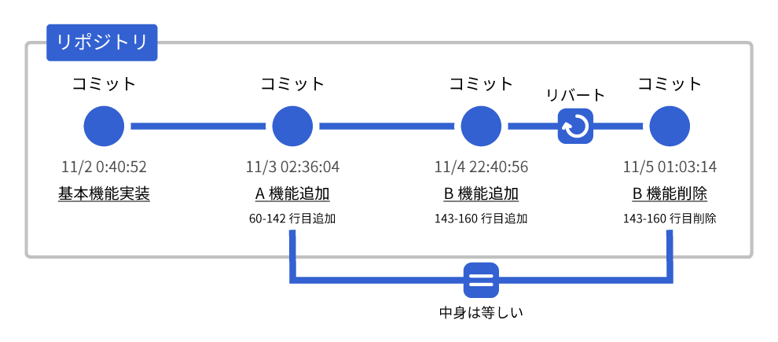
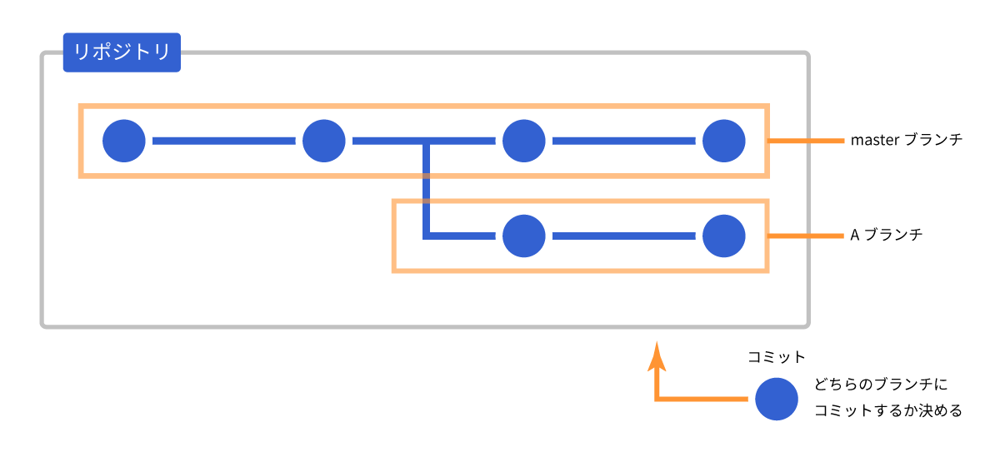

## 2. Gitの概念を学ぼう

---

### リポジトリ (repository)

- プロジェクトのようなもの
- ソースコードのかたまり

---

### コミット (commit)

- リポジトリの中身を変更したとき、その変更を記録すること、またはその記録のこと
	- プログラムを保存するたびに変更を記憶しているイメージ
- コミット内容のイメージ
	- 2018/4/2 0:40:20
	- 機能Aを実装
	- index.html 50-124行目追加 (追加内容)
	- index.html 12-13行目削除

|||

---

### リバート (revert)

- コミットを元に戻すこと  

##### × コミットを削除する
##### ○ 前の状態に戻るようにコミットをする

---

### GitHubでリポジトリを共有しよう

- GitHubを使えば**リモートリポジトリ**が持てる
	- GitHub上のリポジトリ
- 自分のPCのリポジトリは**ローカルリポジトリ**という
- ローカルとリモートでコミットをやりとりすることで、ソースコードを公開したりダウンロードしたりできる

---

### プッシュ (push)

- ローカルリポジトリのコミットをリモートリポジトリにアップロードすること
- プッシュが完了すると、リモートリポジトリはローカルと同じ状態になる

#### ローカル → リモート

---

### プル (pull)

- リモートリポジトリのコミットをローカルリポジトリにダウンロードすること
- プルが完了すると、ローカルリポジトリはリモートと同じ状態になる

#### リモート → ローカル

---

### クローン (clone)

- リモートリポジトリからローカルに丸ごとダウンロードすること
- ローカルにはリポジトリがない状態で最初に行うのがクローン
  
#### ローカル = リモート

---

### ブランチで共同作業しよう

- 共同プロジェクトで作業を分担していると、各々がコードを書き換えていくので動かなくなることがある
	- ブランチを使って並行作業することで自分のコードを他人にいじられなくする

---

### ブランチ (branch)

- コミットの流れのこと
- コミットを分岐させることで独立に作業ができる
- ブランチの中にコミットがあり、デフォルトでは`master`というブランチにコミットされる

|||

### マージ (merge)

- 2つのブランチを1つに統合すること

|||

#### コンフリクト (conflict)

- マージしたときに2つの変更箇所が競合すること
- コンフリクトが発生したら**手動で修正する必要がある**
	- どちらのコミットを採用するか選択する
- 2つのブランチをマージするときやプルしたときに発生する
- 通常コンフリクトを解決するのは面倒な作業だが、**VSCodeにはコンフリクトを一発で解決できる機能がある**

---

### まとめ

- リポジトリ ≒ プロジェクト
- コミット = コードの更新記録の単位
- プッシュ ≒ アップロード
- プル ≒ ダウンロード
- クローン ≒ ダウンロード (最初だけ)
- ブランチ = コミットのかたまり
- マージ = ブランチを統合すること