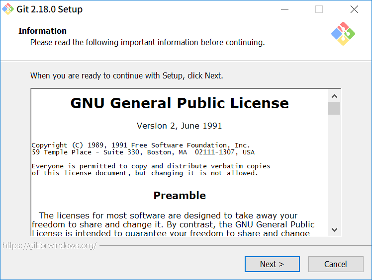
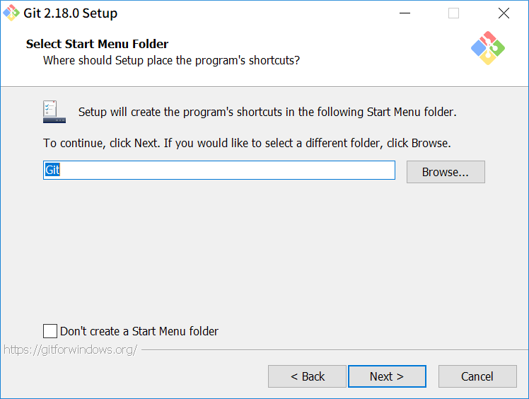
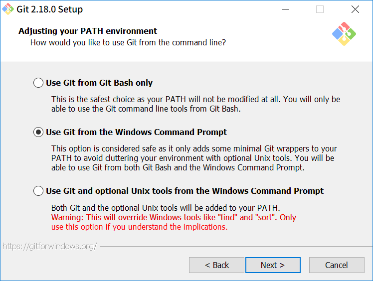
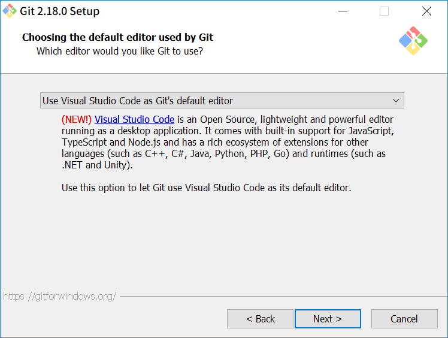
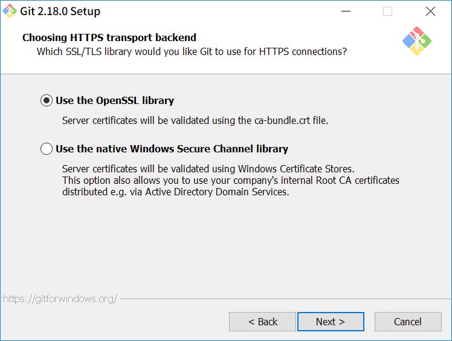
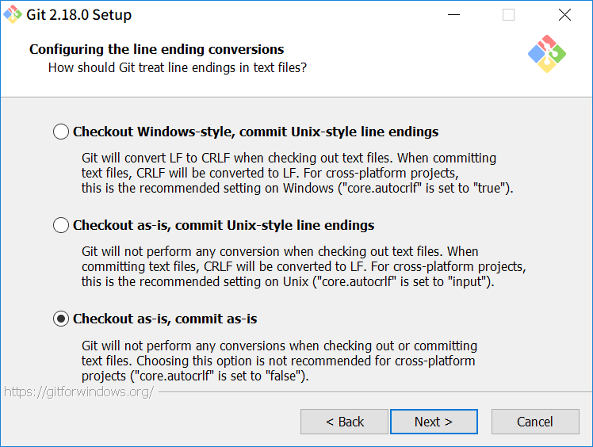
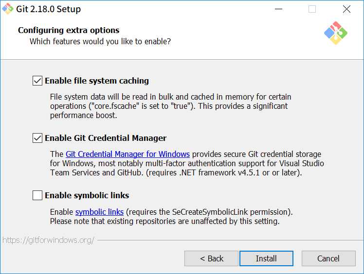
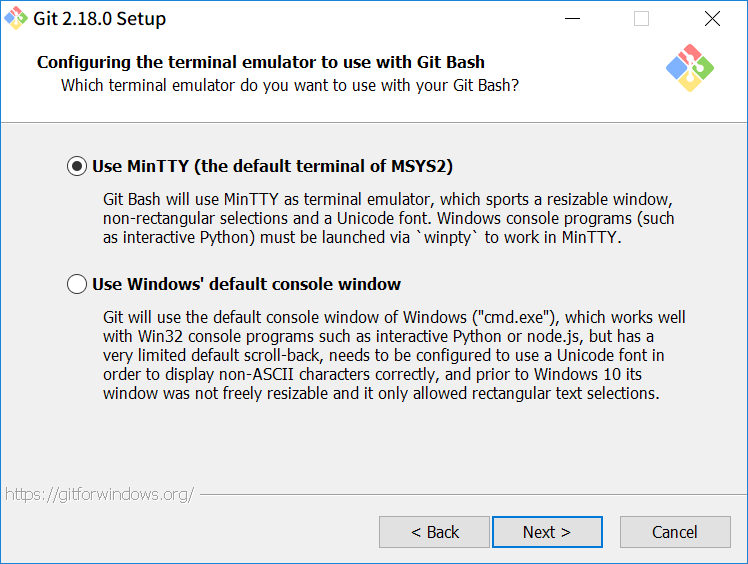
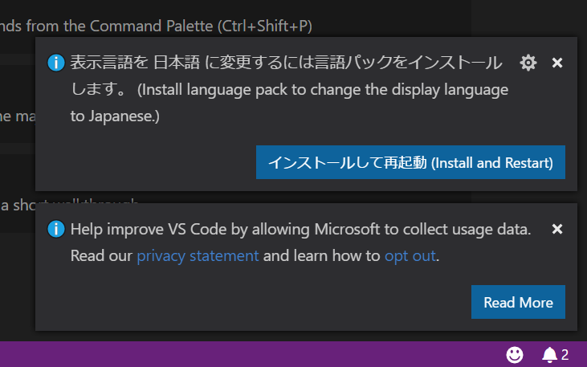

## 3. 環境構築

---

### 準備

- Gitのインストール
    - Windows: 次に説明します
    - Mac: デフォルトで入っていることが多い
        - ターミナルを開いて`git`と打って確かめる
- [GitHub](https:/github.com)アカウント
    - ユーザ名は後から変えづらいので慎重に！
    - プランは`Free`
- [Visual Studio Code](https://code.visualstudio.com/)

---

~~{:grid-container}~~

### Git for Windowsのインストール

~~{:lead}~~

- [Git for Windows](https://gitforwindows.org/)からダウンロード
- インストーラーのバージョンは`2.18.0`

~~x~~
~~{:left}~~

#### 1. そのままNext

~~x~~

~~{:right}~~

#### 2. そのままNext

~~x~~
~~x~~

Note:
参考: https://opcdiary.net/?page_id=27065

|||

~~{:grid-container}~~
~~{:left}~~

#### 3. そのままNext

#### 5. `Use Git from the Windows Command Prompt`を選択

~~x~~

~~{:right}~~

#### 4. `Use Visual Studio Code as Git's default editor`を選択

#### 6. `Use the OpenSSL library`を選択

~~x~~
~~x~~

|||

~~{:grid-container}~~
~~{:left}~~

#### 7. `Checkout as-is, comment as-is`を選択

#### 9. そのままInstall

~~x~~

~~{:right}~~

#### 8. `Use MinTTY`を選択

~~x~~
~~x~~

---

### VSCodeを日本語化する

- 起動すると右下にこのようなポップアップが出てくる
- `インストールして再起動`

