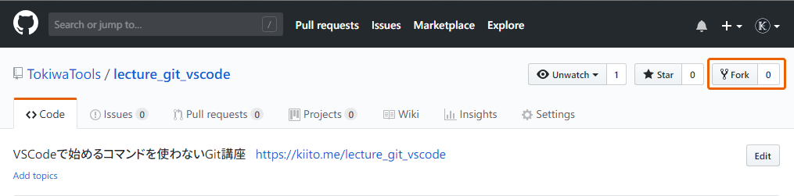
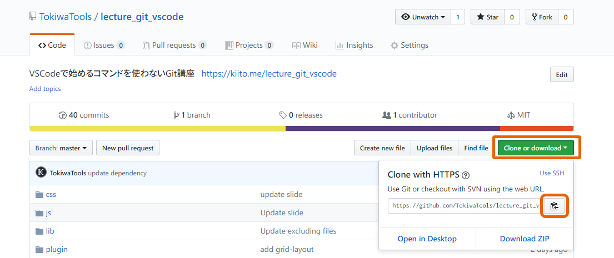
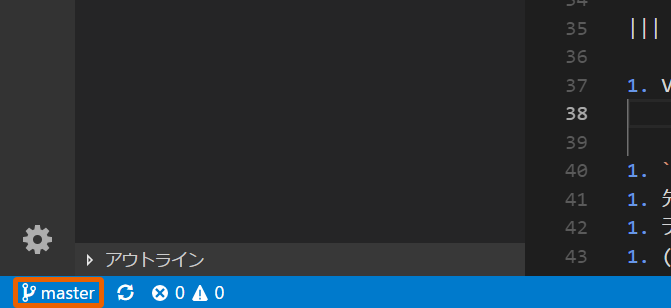
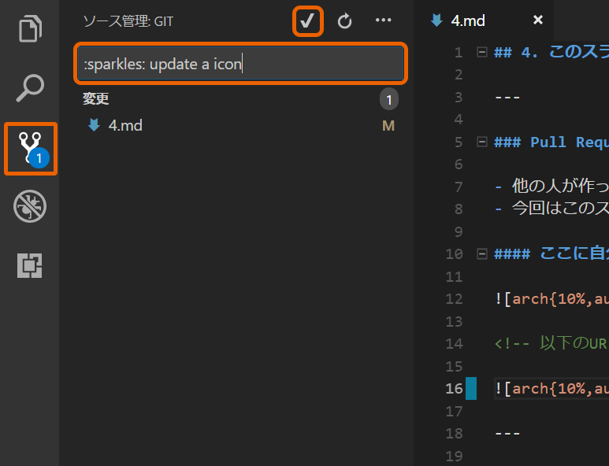
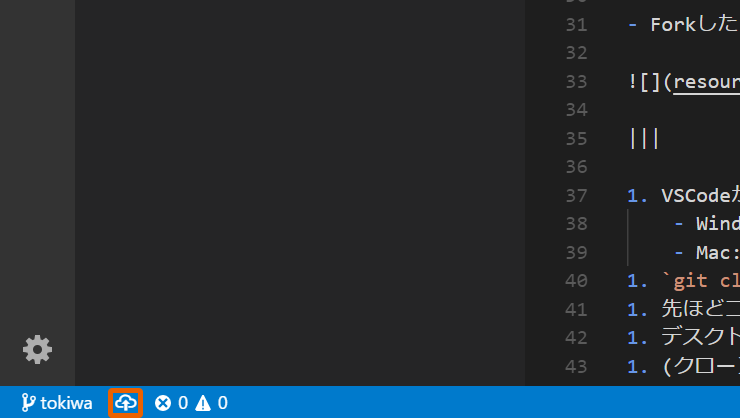
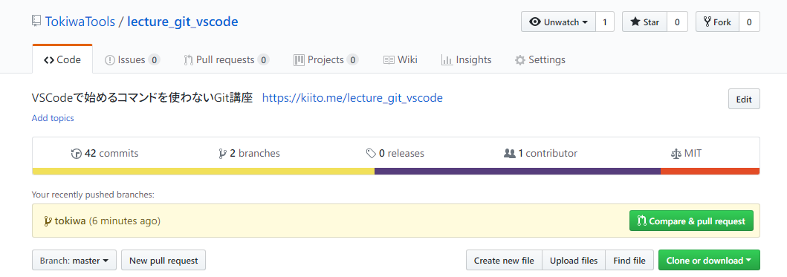

## 4. このスライドにPull Requestしてみよう

---

### Pull Requestとは

- 他の人が作ったリポジトリに修正を加えて変更を提案すること
- 今回はこのスライドのリポジトリにPull Requestするまでが課題

#### ここに自分のアイコンを追加しよう

<!-- 以下のURLを自分のアイコンにする -->

---

### 4-1. リポジトリをForkする

- [ここ](https://github.com/TokiwaTools/lecture_git_vscode)からForkする
	- Fork: 他人のリポジトリを自分のGitHubにコピーすること

---

### 4-2. クローンする

- ForkしたリポジトリのページでリポジトリのURLをコピー

|||

1. VSCodeから
	- Windows: `Ctrl + Shift + P`
	- Mac: `⌘ + Shift + P`
1. `git clone`と入力し`Git: クローン`を選択
1. 先ほどコピーしたURLを貼る
1. デスクトップに`git`というフォルダを作りそのフォルダを選択する
1. (クローンが終わったら)右下のポップアップから`リポジトリを開く`を選択

---

### 4-3. ブランチを作る

1. 左下の`master`となっているボタンをクリック
2. `新しいブランチを作成`から適当な名前でブランチを作る

---

### 4-4. ファイルを編集する

1. 左のエクスプローラから`4.md`を開く
2. 16行目のURLを自分のアイコンに設定する
	- Twitterから画像を引っ張ってきてよい
3. 保存する

---

### (番外編) mdファイルって？

- **Markdown** というファイル形式
- HTMLを簡単に記述できる
- GitHubを初め、Slack、はてなブログ、ATNDなど様々なサービスで利用できる
- 参考: [Markdown記法 チートシート](https://qiita.com/Qiita/items/c686397e4a0f4f11683d)

---

### 4-4. コミットしてプッシュしてみよう

1. 保存すると左の`ソース管理`メニューのバッチが①になる
1. コミットメッセージを書いて :white_check_mark: でコミット
	- `すべての変更を自動的にステージして、直接コミットしますか？`というメッセージがでるので`はい`
	- **ステージング**とはコミットする対象のファイルを指定する工程です

---

### (余談) コミットメッセージについて

- コミットメッセージの書き方は自由ですが、界隈では一応原則があります
	- 1行目: 変更内容の要約
	- 2行目: (空行)
	- 3行目: 変更した詳細、理由
	- 参考: [Gitのコミットメッセージの書き方](https://qiita.com/itosho/items/9565c6ad2ffc24c09364)
- 日本語でもOKですが、英語で書いておくとPull Requestしたい外国人にとって分かりやすいです
	- プログラミング言語は英語でできているので、個人的には英語で書くと親和性が高いと思います
- 絵文字でどのようなコミットか表すと分かりやすいです
	- `:sparkles:` -> :sparkles: のように表示されます
	- 参考: https://qiita.com/pocotan001/items/775cc77087be5562cc56

---

### (余談) コミットの粒度について

- どのぐらい作業したらコミットするかは人によってばらばら
- 基本的に1タスク1コミットが理想
	- 1つのコミットに複数の変更点を混ぜるとリバートするときに面倒
- 参考: [「コミットの粒度がわからない問題」の模範解答を考えてみた](https://qiita.com/jnchito/items/40e0c7d32fde352607be)

---

### 4-5. プッシュしてGitHubに反映してみよう

1. 左下の:cloud:雲マークからプッシュする
2. GitHubにログインを求められるのでログインする

|||

自分のリポジトリページにアクセスし、このような表示があったら成功

---

### 4-6. アイコンが変わっているか確認しよう

1. 自分のリポジトリページの上メニュー`Settings`
2. `GitHub Pages` → `Source` を `master branch`にする
3. `Save`
4. `GitHub Pages` に `Your site is ready to be published at {URL}`とあるのでクリック
5. 少し経つと反映される (何回か更新しよう)

---

### 4-7. 元のリポジトリにPull Requestしよう

1. 自分のリポジトリページに表示された`Compare & pull request`からできる
2. そのまま`Create pull request`で完了
   - 元のブランチにマージするのでコンフリクトが起こることもある

#### 元のリポジトリのユーザがPull Requestを採用すれば、自分のコミットが反映される

Note: Pull Requestが来たら採用する
Conflictはなんとかする