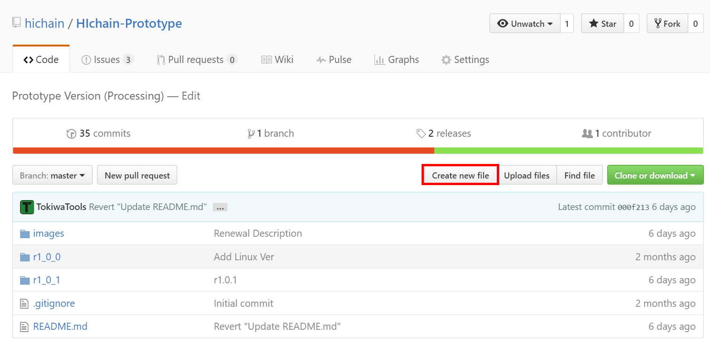
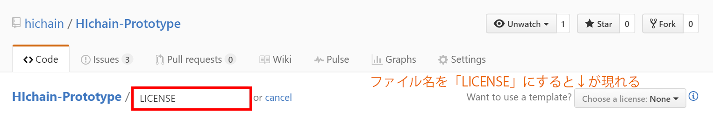

## 5. おまけ

---

### GitHubの便利機能

- ソースコードを公開するだけでなく、様々な機能がある

|||

### README

- リポジトリのルートディレクトリに`README.md`というファイルを置くと、その中身がリポジトリのページに表示される
    - Markdown記法で書ける
- 書くべき内容
    - タイトル
    - (GUIソフトなら)GIFアニメ
    - 説明
    - ダウンロード先一覧
    - 使い方
    - 制作者
    - ライセンス
    - リンク集 など

|||

### LICENSE

- プログラムのライセンスを明記できる
    - ルートディレクトリの`LICENSE`というファイルがライセンスの条文になる
- GitHubではライセンスを明記しない場合、デフォルトで著作権法が適用される
    - ソースコードの閲覧・実行はできるが、複製・再配布・二次創作はできない
- オープンソースにするにはライセンスを明記する必要がある

|||

### 後からライセンスを設定する方法

1. リポジトリのページから`Create new file`
2. `LICENSE`というファイル名で作るとテンプレートを選ぶ項目が出現する

|||

### その他

- [リリース](https://qiita.com/todogzm/items/db9f5f2cedf976379f84)
    - GitHubで開発したソフトウェアをGitHub上で配布できる
- [Issues](https://seleck.cc/647)
    - ユーザがバグ報告や質問を開発者に投げることができる掲示板
    - Markdownが使える

---

### GitHub Education

- 大学・研究機関向けのアカデミック版
- 通常課金が必要なプライベートリポジトリが**無料で作成できる**
    - プライベートリポジトリ: Web上に公開しないリポジトリ
- 個人アカウントと組織アカウント(Organization)のどちらにも適用できる
    - 個人アカウントならmeiji.ac.jpのメールアドレスで登録すれば利用できる (複数体験談)
    - 組織アカウントは学生証を添付する必要がある？ (自己体験談)

---

### VSCodeで便利なgit拡張機能

- [Git History](https://marketplace.visualstudio.com/items?itemName=donjayamanne.githistory)
    - gitのコミット履歴をグラフィカルに表示する

---

### 次回

#### **GitHub × Markdown活用講座**

- 応用編としてGitHubを使ってポートフォリオ(自分のサイト)を作ります
    - [総コンHP](https://sokon.jp)や[自分のポートフォリオ](https://kiito.me)もGitHubで動いてます
- このスライドも実はGitHubで動いてます
    - Markdownで記述してます
    - このスライドの作り方も軽く触れます
- 応用編はコマンドを使うのですこし発展的な内容です
- 次回基礎編開催日(8月下旬～9月上旬)の後にできればやります

---

### 参考

- [コマンドを使わないGitHub講座](https://sway.com/wAxbm1lRRXUqJb7E)
    - 以前自分が作ったスライド