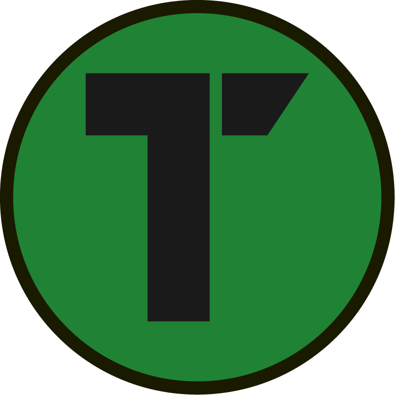

# Title

---

~~{:grid-container}~~

## H2

.lead

~~{:left}~~

.description
- hoge
	- aaa
	- aa

~~x~~

~~{:right}~~

~~x~~

~~{:footer}~~

footer

~~x~~

~~x~~

---

~~{:grid-container}~~

## オニオンアーキテクチャ

~~{:lead}~~

Jeffrey Palermo氏が提唱したアーキテクチャ
 外側の層から内側の層のみ依存関係

~~x~~

~~{:left}~~

.特徴 :mag:
 - ドメインモデルは完全独立
   * インフラの寿命は３年
 - 依存性逆転の法則(DIP)
   * 内: インタフェースを定義
   * 外: 具象を実装
~~x~~

~~{:right}~~

~~x~~

~~{:footer}~~
 画像出典: [ドメイン駆動 + オニオンアーキテクチャ概略](https://qiita.com/little_hand_s/items/2040fba15d90b93fc124)
~~x~~

~~x~~